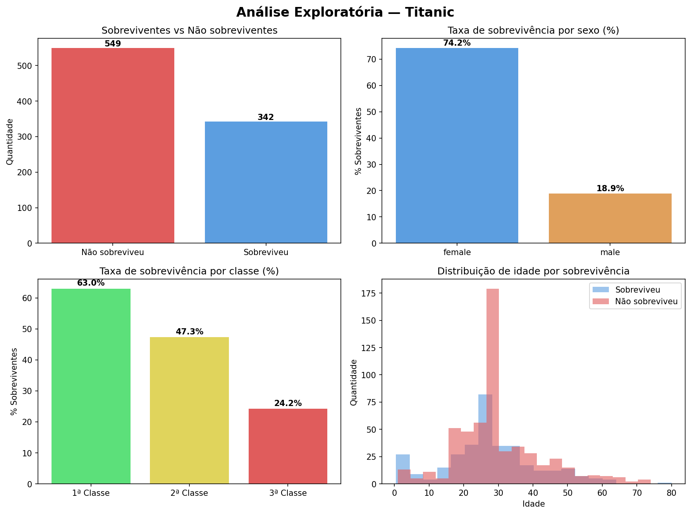

import os

notebook_url = "https://colab.research.google.com/github/SEU_USUARIO/analise-titanic/blob/main/titanic_analysis.ipynb"

readme = """# 🚢 Análise Exploratória — Titanic

Exploração dos dados do Titanic buscando padrões entre quem sobreviveu e quem não sobreviveu.
Cresci assistindo o filme e sempre quis entender se os dados confirmam o que aparece na tela — confirmam.

## O que os dados mostram

- **Mulheres sobreviveram muito mais que homens** — a política "mulheres e crianças primeiro" aparece claramente nos números
- **Classe social foi determinante** — passageiros da 1ª classe tiveram taxa de sobrevivência quase 3x maior que os da 3ª
- **A faixa de 25 a 35 anos morreu mais** — provavelmente homens adultos que cederam lugar nos botes

## Tecnologias

- Python 3
- pandas
- matplotlib
- seaborn

## Como rodar

1. Clique no badge **Open in Colab** acima
2. Vá em `Runtime > Run all`
3. Os gráficos e a imagem são gerados automaticamente

## Resultado

""".format(notebook_url)

with open('/content/README.md', 'w', encoding='utf-8') as f:
    f.write(readme)

print("README atualizado!")
